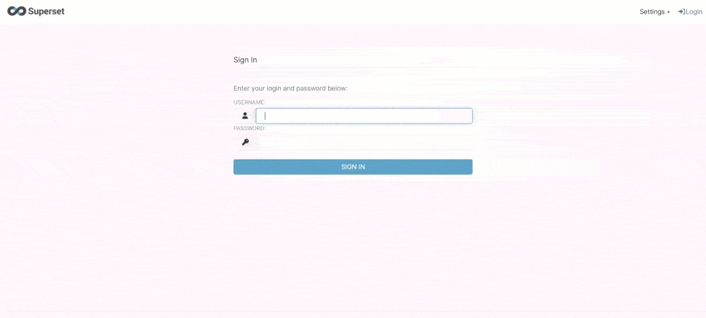

# House Gold Dollar Tracker


**House Gold Dollar Tracker** is a real-time data pipeline that collects **house prices** and **gold/dollar prices** from publicly available sources, streams the data into **Apache Kafka**, and stores it in a distributed **ClickHouse** cluster. The pipeline is orchestrated using **Apache Airflow**, with interactive dashboards in **Apache Superset** and a **chatbot** for querying the data. Built with Docker for easy deployment.

---

## Features

- **Data Collection**: Automatically collects house prices and gold/dollar prices from publicly available sources.
- **Real-Time Streaming**: Uses Apache Kafka for real-time data streaming.
- **Distributed Database**: Stores data in a 4-node ClickHouse cluster for high-performance analytics.
- **Orchestration**: Managed by Apache Airflow for scheduling and monitoring workflows.
- **Visualization**: Interactive dashboards in Apache Superset for data exploration.
- **Chatbot**: A chatbot that answers user queries by querying the database.

---

## Technologies

- **Data Collection**: Python
- **Streaming**: Apache Kafka
- **Database**: ClickHouse
- **Orchestration**: Apache Airflow
- **Visualization**: Apache Superset
- **Chatbot**: Chainlit
- **Deployment**: Docker

---

## Setup Instructions

### Prerequisites

- Docker and Docker Compose installed.
- Python 3.8+.

### Steps

1. **Clone the Repository**:
   ```bash
   git clone https://github.com/safdarian/house_gold_dollar_tracker.git
   cd house_gold_dollar_tracker
   ```

2. **Start the Docker Containers**:
   ```bash
   docker-compose up -d
   ```

3. **Access the Services**:
   - **Airflow**: Open `http://localhost:8080` in your browser.
   - **Superset**: Open `http://localhost:8088` in your browser.
   - **Chatbot**: Open `http://localhost:8000` in your browser.

4. **Run the Data Collection**:
   - The data collection processes will start automatically via Airflow.

5. **Explore Data**:
   - Use Superset to create and view dashboards.
   - Interact with the chatbot to query the database.

---

## Usage

### Chatbot Queries
Ask the chatbot questions like:
- "What is the current gold price?"
- "Show me the average house price in Tehran."
- "What is the dollar exchange rate today?"


### Superset Dashboards
Create and explore dashboards to visualize:
- House price trends.
- Gold and dollar price fluctuations.



### Distributed ClickHouse Database
The data is stored in a distributed ClickHouse cluster. Here's a demonstration of the database nodes and their functionality:


---

## License

This project is protected under a **custom license**. All rights are reserved. You are not permitted to use, copy, modify, distribute, or otherwise exploit this project for any purpose without explicit written permission from the author.

To request permission, please contact safdarian2000@gmail.com.

---

## Contributing

Contributions are welcome! However, please note that all contributions will be subject to the same custom license. If you would like to contribute, please open an issue or submit a pull request, and ensure you have obtained permission from the author.

---

## Acknowledgments

- Data sources: Publicly available sources for house prices and gold/dollar prices.
- Tools: Apache Kafka, ClickHouse, Apache Airflow, Apache Superset, Chainlit
